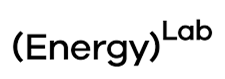

# EnergyLab Foundational PyPSA Course

Welcome to the EnergyLab Foundational PyPSA Course! This course is designed to give you the foundational skills needed to work with Python and build energy system models using PyPSA (Python for Power System Analysis).

## About This Course

This course takes you from Python basics through to building real-world PyPSA energy models. Whether you are new to programming or looking to develop hands-on energy modelling skills, this course provides a structured path through:

- Core Python programming skills
- Data manipulation with Pandas
- Geospatial analysis with GeoPandas
- Working with real-world energy datasets (GRDC)
- Building stochastic energy models (Zambia case study)
- Building multi-node PyPSA models (Japan case study)

Each lesson builds on the previous, equipping you with practical skills for energy system analysis and PyPSA model development.

## Contact

<div style="display: flex; align-items: center; justify-content: space-between; gap: 30px;">
  <div>
    <h3 style="margin-top: 0;">Instructor</h3>
    <p style="margin: 5px 0; font-size: 20px;"><strong>Priyesh Gosai</strong></p>
    <hr style="margin: 12px 0; border: none; border-top: 1px solid #ccc;">
    <p style="margin: 6px 0; font-size: 13px;"><a href="mailto:priyesh@innovateimpact.com">priyesh@innovateimpact.com</a></p>
    <p style="margin: 6px 0; font-size: 13px;"><a href="https://www.linkedin.com/in/gosaip/">LinkedIn</a> | <a href="https://github.com/PriyeshGosai">GitHub</a></p>
  </div>
  <div style="display: flex; align-items: center; gap: 20px;">
    
    
    
  </div>
</div>


## Getting Started

### Option 1: Google Colab (Recommended for Beginners)

You can run the notebooks directly in your browser using Google Colab — no installation required. Click the rocket icon at the top of any lesson page and select "Colab" to get started. A Google account is required.

### Option 2: Local Installation

To run the notebooks locally:

1. **Clone this repository:**
   ```bash
   git clone https://github.com/PriyeshGosai/energylab-foundational-pypsa.git
   cd energylab-foundational-pypsa
   ```

2. **Install dependencies:**
   ```bash
   pip install -r requirements.txt
   ```

3. **Launch Jupyter Lab:**
   ```bash
   jupyter lab
   ```

## Course Contents

This course consists of six lessons covering Python fundamentals and PyPSA modelling:

- **Lesson 1:** Python Introduction — core programming concepts and syntax
- **Lesson 2:** Introduction to Pandas — data manipulation and analysis
- **Lesson 3:** Introduction to GeoPandas — geospatial data for energy systems
- **Lesson 4:** GRDC Data Reader — working with real-world hydrological datasets
- **Lesson 5:** Zambia Stochastic Model — building a stochastic energy model
- **Lesson 6:** Japan PyPSA Model — building a multi-node PyPSA network model

Each lesson includes:
- Conceptual explanations
- Code examples
- Hands-on exercises
- Visualization tools

## Resources

- **PyPSA Documentation:** [https://pypsa.org](https://pypsa.org)
- **PyPSA-Earth:** [https://github.com/pypsa-meets-earth](https://github.com/pypsa-meets-earth)
- **Course Repository:** [https://github.com/PriyeshGosai/energylab-foundational-pypsa](https://github.com/PriyeshGosai/energylab-foundational-pypsa)


## Further Learning
- [Post by Dr. Max Parzen on OpenMod](https://forum.openmod.org/t/getting-started-with-energy-system-modelling-free-courses-tips/5360)
- [Data Science for Energy System Modelling](https://fneum.github.io/data-science-for-esm/intro.html)
- [Integrated Energy Grids course](https://martavp.github.io/integrated-energy-grids/intro.html)


## License

This course material is open source and available for educational purposes.

---

Ready to get started? Navigate to Lesson 1 using the sidebar!
